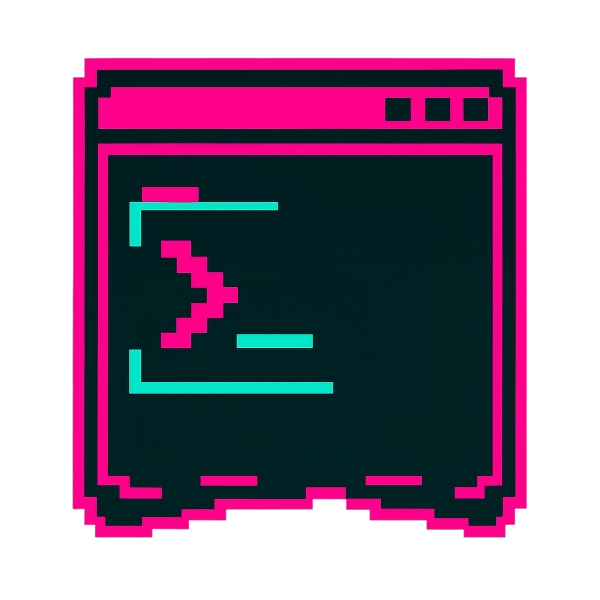

# HOTLINE
<div align=center>
    
</div>   
<div align=center> 
    <i>Another attempt to find the most convient way to manage penetration testing process</i>
</div>
<br>
A modular Bash-based CLI tool to automate logging, directory structure creation, tool execution, and note-taking during penetration testing engagements.

## Installation
```
git clone https://github.com/indigo-sadland/hotline
cd hotline
chmod +x hotline.sh

sudo ln -s $(pwd)/hotline.sh /usr/local/bin/hotline
```
## Usage/Workflow
1. Adjust your current project name in `hotline.conf`
2. Use `hotline initial  <target|range> <nmap-args>` to run nmap and prepare the directory tree for all discovered ports and services under `$HOME/hotline-results` directory.
    ```
    hotline initial 10.10.10.0/24 "-sV -p-"
    ```
3. Set the active target + service context for the `run` and `note` commands using `hotline context <TARGET> <PORT_SERVICE>`.
    ```
    hotline context 10.10.10.5 80_http
    ```
4. Run any CLI tool (e.g., ffuf, sqlmap, feroxbuster) using `run <TOOL COMMAND>`.
    ```
    hotline run ffuf -u http://10.10.10.5/FUZZ -w wordlist.txt
    ```
    It will save the running tool output and the command itself (*just in case you can't remember whether you have already launched such a command on the target or not*).\
    \
    **NOTE:** for `ffuf` and `feroxbuster` it will automatically add the proper output flag. For other tools piping with `tee` will be used.
5. Quickly add notes tied to the current target/service.
    ```
    hotline note "Found possible IDOR at /users/123"
    ```
6. Collect all notes for a host and combine into a single markdown file.
    ```
    hotline collect-notes 10.10.10.5
    ```

## ToDo
- [ ] Hierarchical tree creation based on `ffuf` and `feroxbuster` results;
- [ ] Show current context command;  
- [ ] Integration with `fzf`;
